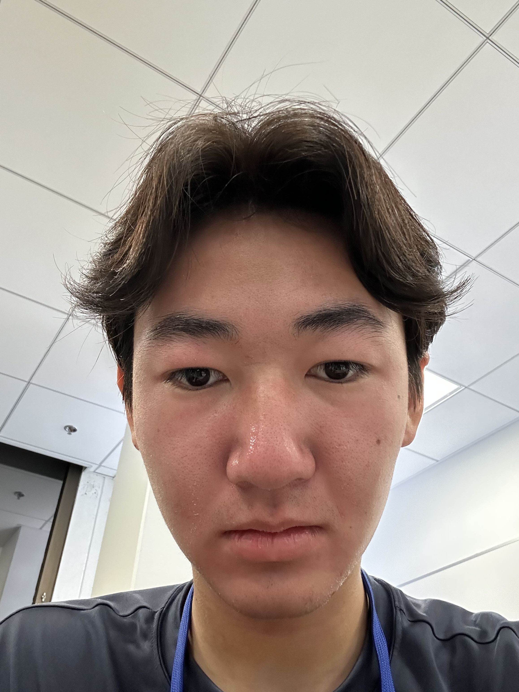
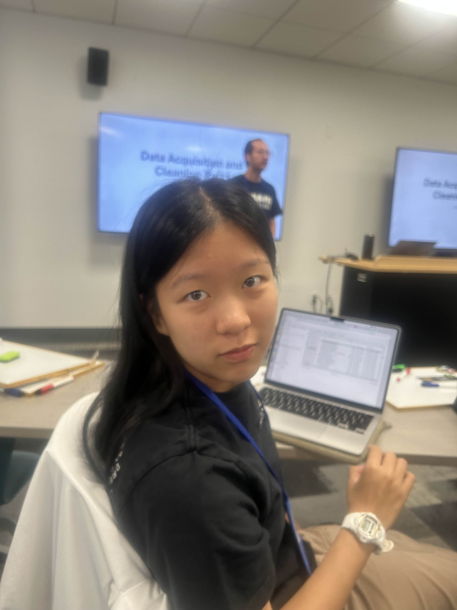
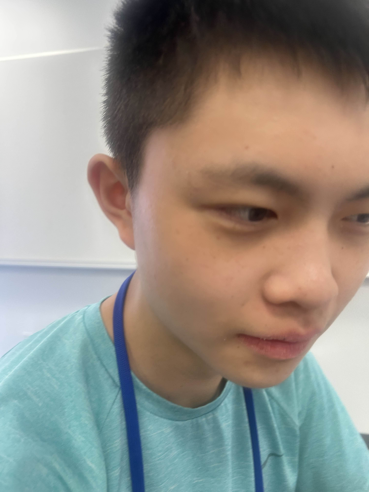

The Optimizers members

---

## Andy Chen

  

  

    

      Snoopy is a lovable beagle and one of the most iconic characters from the Peanuts comic strip, created by Charles M. Schulz. 
    

    <ul style="margin: 0; padding-left: 20px;">
      <li>Loyal companion of Charlie Brown</li>
      <li>Loves root beer and pizza</li>
      <li>Sleeps on top of his doghouse, not inside it/li>
    </ul>
  

---

## Chloe Huang

  

  

    

      Chloe is a high schooler from the Bay Area. When not working on her spreadsheets and data science projects, she also likes to read, listen to music, and bake.
    

    <ul style="margin: 0; padding-left: 20px;">
      <li>intj</li>
      <li>dancer</li>
      <li>miffy enthusiast</li>
    </ul>
  

---

## Jacob Wang

  

  

    

      Jacob is a high schooler from Fremont in the Bay Area.
    

    <ul style="margin: 0; padding-left: 20px;">
      <li>badminton</li></li>
      <li>cubing</li>
      <li>tetris</li>
    </ul>
  

  

---

## Joshua Wu

  

  

    

      Lucy Van Pelt is ...
    

    <ul style="margin: 0; padding-left: 20px;">
      <li>AAA</li>
      <li>BBB</li>
      <li>CCC</li>
    </ul>
  

  

