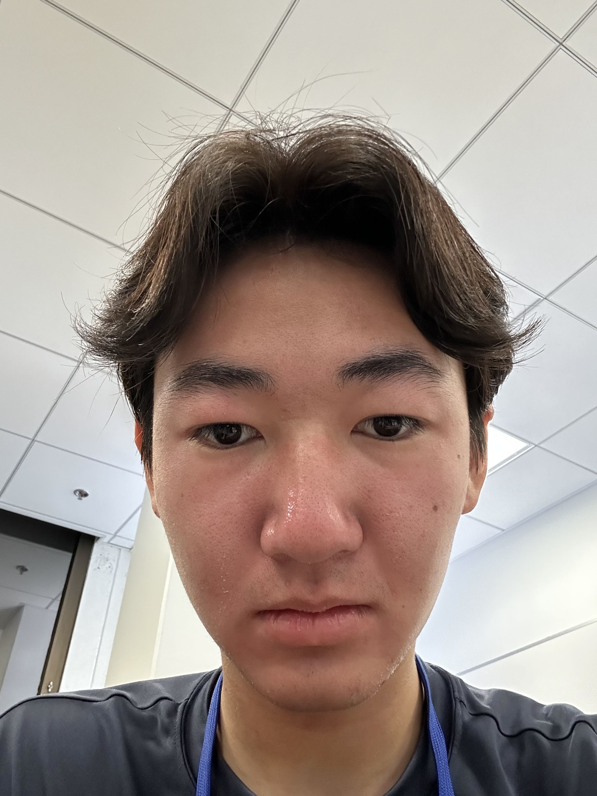
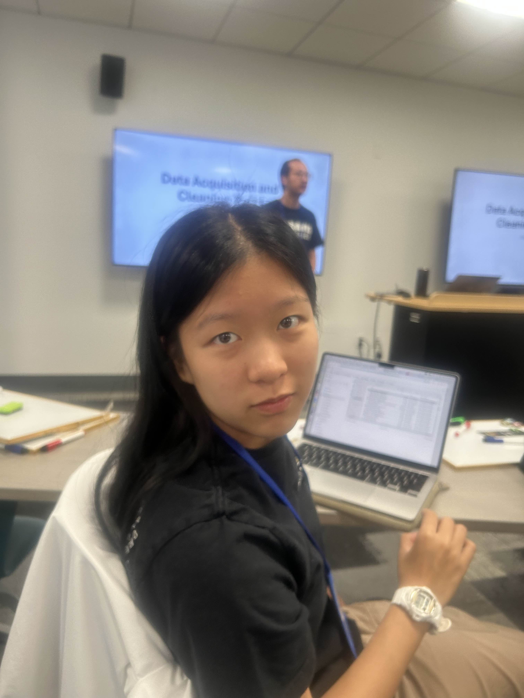
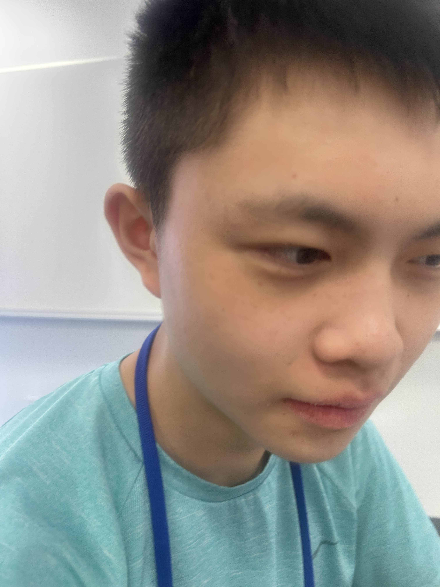
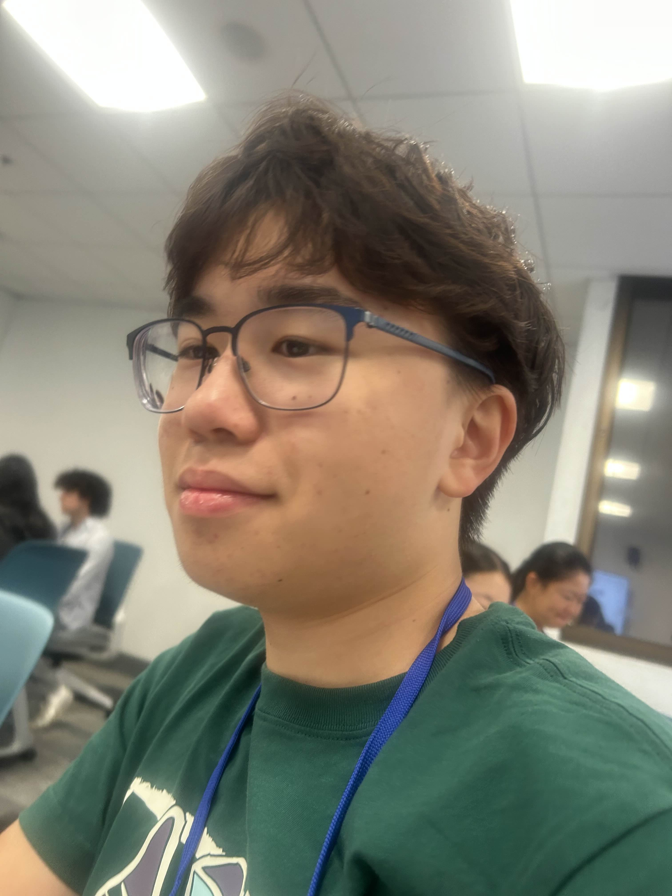

The Optimizers members

---

## Andy Chen

  

  

    

      Andy Chen is a student from San Jose, California. In his free time, he enjoys watching movies, playing games, and eating new foods.
    

  

---

## Chloe Huang

  

  

    

      Chloe is a high schooler from the Bay Area. When not working on her spreadsheets and data science projects, she also likes to read, listen to music, and bake.
    

  

---

## Jacob Wang

  

  

    

      Jacob is a student from Fremont in the Bay Area. Some of his interests include, cubing, tetris, and badminton.
    

  

  

---

## Joshua Wu

  

  

    

      Joshua is a student from the Bay Area. When not structuring and analyzing data, he enjoys trying new food, listening to music, and hanging out with friends.
    

  

  

